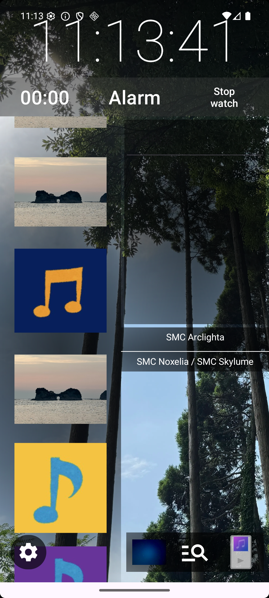
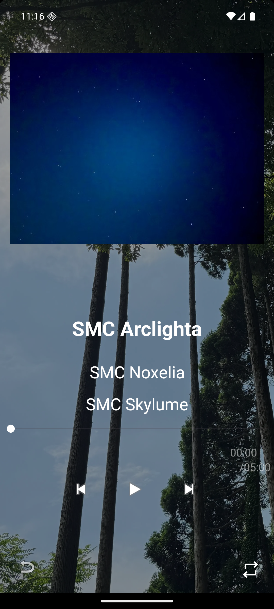
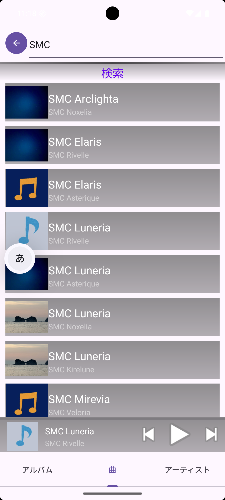
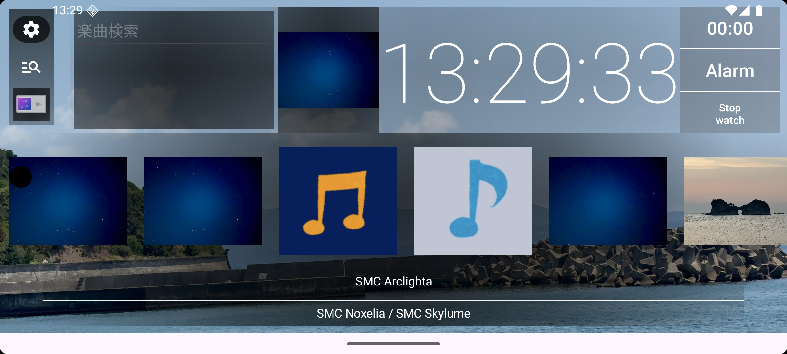
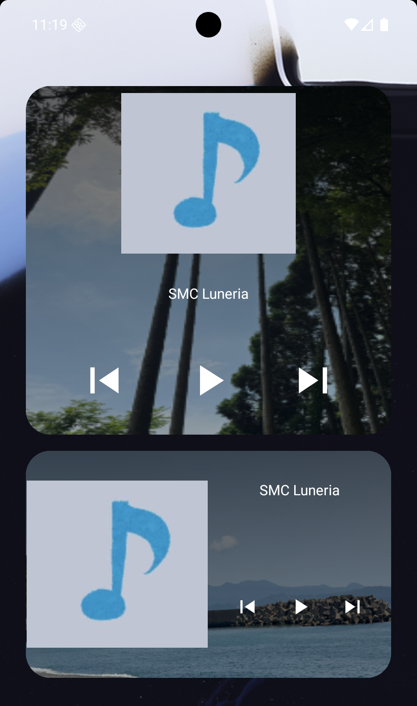

# Sense Music Clock

Sense Music Clock は、時計・タイマー・アラーム・ストップウォッチとローカル音楽プレイヤーをひとつの画面で扱う Android アプリです。

端末内の音楽ファイルを読み込み、アルバムアート付きのリスト、検索、プレイリスト、ブロックリスト、背景画像の切り替え、ホーム画面ウィジェットからの再生操作に対応しています。

## Screenshots

<p>
  
  
  
</p>

<p>
  
  
</p>

## Features

- 時計、タイマー、アラーム、ストップウォッチをメイン画面に表示
- Media3 ベースのローカル音楽再生
- アルバムアート付きの楽曲一覧表示
- 楽曲、アルバム、アーティストの検索・検索履歴
- プレイリストとブロックリストの管理
- 最近追加された曲の再生モード
- シャッフル、一曲ループ、音量調整、スリープタイマー
- 背景画像の追加、選択、ランダム表示
- ホーム画面ウィジェットからの再生、停止、前後スキップ
- 縦画面・横画面のプレイヤー UI


## Requirements

- Android Studio
- JDK 21
- Android SDK
  - compileSdk: 37
  - minSdk: 32
  - targetSdk: 36

このプロジェクトは Gradle Wrapper を同梱しています。通常はローカルに Gradle を別途インストールする必要はありません。

## Setup

1. リポジトリをクローンします。

   ```sh
   git clone <repository-url>
   cd SenseMusicClock
   ```

2. Android Studio でプロジェクトを開きます。

3. Firebase / Crashlytics を使う場合は、Firebase プロジェクトから取得した `google-services.json` を `app/google-services.json` に配置します。

4. デバッグビルドを作成します。

   ```sh
   ./gradlew assembleDebug
   ```

5. 端末またはエミュレーターにインストールします。

   ```sh
   ./gradlew installDebug
   ```

## Permissions

アプリは主に以下の Android 権限を使用します。

- `READ_MEDIA_AUDIO`: 端末内の音楽ファイルを読み込むため
- `FOREGROUND_SERVICE_MEDIA_PLAYBACK`: 音楽再生サービスを継続するため
- `POST_NOTIFICATIONS`: 再生中やサービス動作中の通知を表示するため
- `USE_EXACT_ALARM`: アラーム機能を動作させるため
- `VIBRATE`: アラームや通知の振動に使用するため

初回起動時や機能利用時に、端末側で必要な権限を許可してください。

## Tech Stack

- Kotlin
- Android Views / ViewBinding
- Jetpack Compose
- Media3
- Room
- DataStore
- Paging
- Coil
- Glance App Widget
- Firebase Crashlytics

## Project Structure

```text
app/src/main/java/jp/gr/java_conf/SenseMusicClock/
├── Clock/      # タイマー、アラーム、ストップウォッチ関連
├── Music/      # 音楽検索、再生サービス、DB、リポジトリ
├── ui/         # Activity、リスト、検索、設定、ウィジェット UI
└── ...

app/src/main/res/
├── layout/     # XML レイアウト
├── drawable/   # 背景、アイコン、アルバムアートの既定画像
├── values/     # 文字列、テーマ、色、寸法
└── xml/        # 設定画面、バックアップ、ウィジェット定義
```

## Useful Commands

```sh
./gradlew assembleDebug
./gradlew testDebugUnitTest
./gradlew connectedDebugAndroidTest
```

`connectedDebugAndroidTest` は、接続済みの実機または起動済みエミュレーターが必要です。

## License

MIT License. See [LICENSE](LICENSE).
