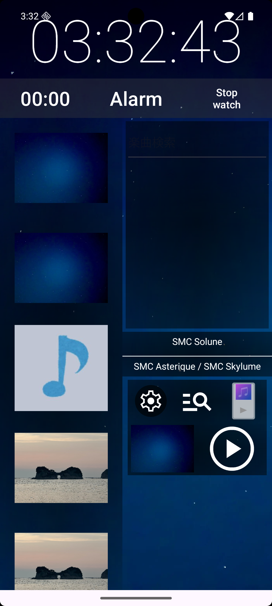
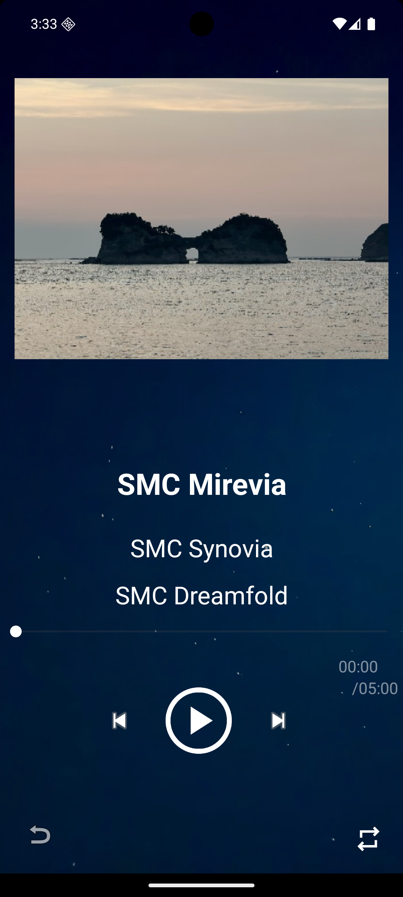
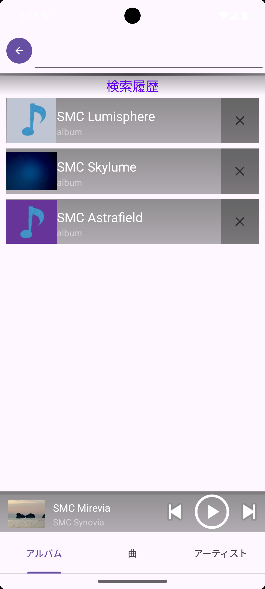
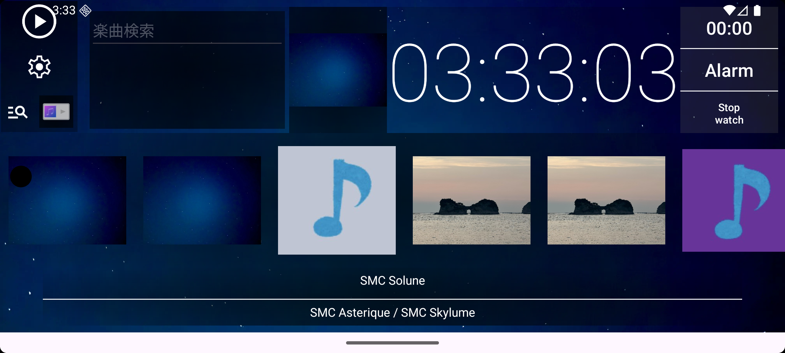
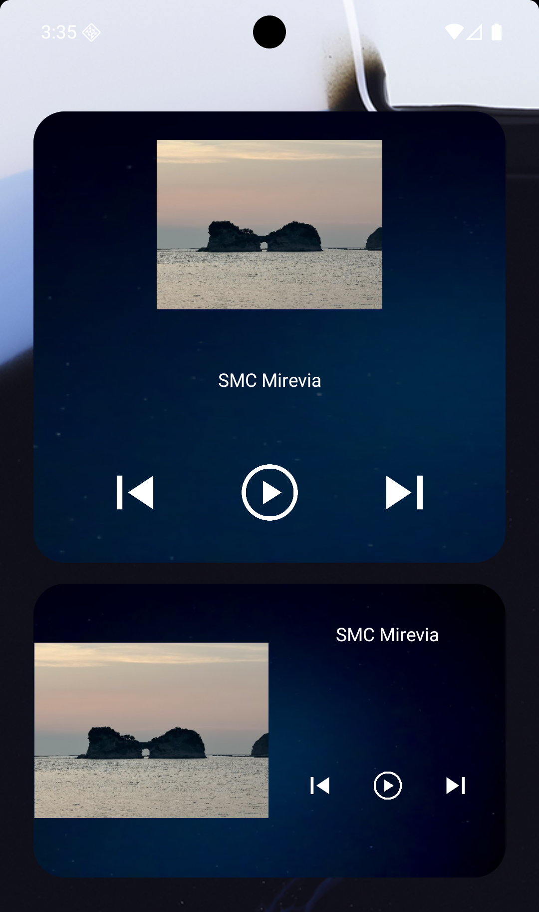

# Sense Music Clock

Sense Music Clock は、時計・タイマー・アラーム・ストップウォッチとローカル音楽プレイヤーをひとつの画面で扱う Android アプリです。

端末内の音楽ファイルを読み込み、アルバムアート付きのリスト、検索、プレイリスト、ブロックリスト、背景画像の切り替え、ホーム画面ウィジェットからの再生操作に対応しています。

## Screenshots

  
  
  

  
  

## Features

- 時計、タイマー、アラーム、ストップウォッチをメイン画面に表示
- Media3 ベースのローカル音楽再生
- アルバムアート付きの楽曲一覧表示
- 楽曲、アルバム、アーティストの検索・検索履歴
- プレイリストとブロックリストの管理
- 最近追加された曲の再生モード
- シャッフル、一曲ループ、音量調整、スリープタイマー
- 背景画像の追加、選択、ランダム表示
- ホーム画面ウィジェットからの再生、停止、前後スキップ
- 縦画面・横画面のプレイヤー UI

## License

MIT License. See [LICENSE](LICENSE).
